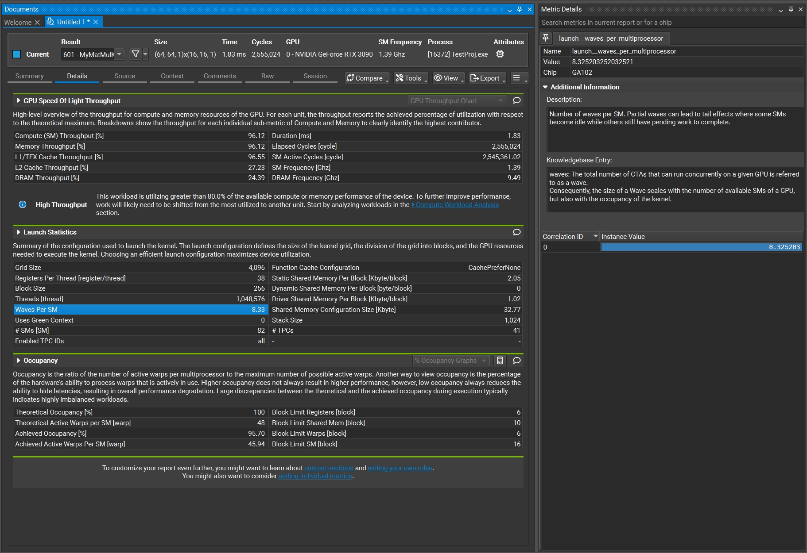

因为最近读完了《Programming Massively Parallel Processors: A Hands-on Approach (4th Edition)》这本书（下面简称 PMPP），非常想结合书中的内容实操一下。所以我基于 [tpoisonooo/how-to-optimize-gemm: row-major matmul optimization](https://github.com/tpoisonooo/how-to-optimize-gemm/tree/master) 这个很好的 repo（下面简称原 repo）和对应的[注解](https://zhuanlan.zhihu.com/p/478846788)，重新写了一版代码，使整体更加简洁易懂一点，同时记录一下学习的过程。

## 第一版实现：naive

第一版基本是最 naive 的实现。如果这个矩阵乘法是 $A \times B = C$，$A$、$B$、$C$ 三个矩阵的维度分别为 $m \times k$、$k \times n$、$m \times n$，则下面的 kernel 中每个线程对应矩阵 $C$ 中的一个元素，所以每个线程会进行 $k$ 次浮点数乘加。

```cuda
#define A(i, j) d_A[(i) * k + (j)]
#define B(i, j) d_B[(i) * n + (j)]
#define C(i, j) d_C[(i) * n + (j)]

// Naive version
__global__ void MyMatMulKernel(float* d_A, float* d_B, float* d_C, int m, int n, int k) {
  int _m = blockIdx.y * blockDim.y + threadIdx.y;
  int _n = blockIdx.x * blockDim.x + threadIdx.x;

  if (_m < m && _n < n) {
    Value_t c_value = 0;
    for (int _k = 0; _k < k; ++_k) c_value += A(_m, _k) * B(_k, _n);
    C(_m, _n) = c_value;
  }
}

void MyMatMul(float* d_A, float* d_B, float* d_C, int m, int n, int k) {
  constexpr int kBlockDim = 16;

  dim3 block(kBlockDim, kBlockDim);
  dim3 grid((n + kBlockDim - 1) / kBlockDim, (m + kBlockDim - 1) / kBlockDim);

  MyMatMulKernel<<<grid, block>>>(d_A, d_B, d_C, m, n, k);
}
```

因为是第一版实现，所以没有在乎任何的参数设置（如 block 大小等）。同时说一下下面所有的测试中都使用 `float` 类型计算，并用我自己的 NVIDIA RTX 3090 来测试。这一版的性能可以达到大约 2.2 TFLOPS（根据参数该卡的理论性能为 35.58 TFLOPS）。

## 第二版实现：tiling

第二版使用了 PMPP 第 5.4 和 5.5 节中提到的 tiling 方法，即将会被重复使用的数据放置在 block 的 shared memory 中，这样减少了 global memory 的重复传输。这个思想也是对应原 repo 中的 [MMult_cuda_3.cu](https://github.com/tpoisonooo/how-to-optimize-gemm/blob/master/cuda/MMult_cuda_3.cu)。

```cuda
#define A(i, j) d_A[(i) * k + (j)]
#define B(i, j) d_B[(i) * n + (j)]
#define C(i, j) d_C[(i) * n + (j)]

// Tiled version
template <int kTileWidth>
__global__ void MyMatMulKernel(float* d_A, float* d_B, float* d_C, int m, int n, int k) {
  __shared__ Value_t Ads[kTileWidth][kTileWidth];
  __shared__ Value_t Bds[kTileWidth][kTileWidth];

  int bx = blockIdx.x;
  int by = blockIdx.y;

  int tx = threadIdx.x;
  int ty = threadIdx.y;

  int _m = by * kTileWidth + ty;
  int _n = bx * kTileWidth + tx;

  Value_t c_value = 0;
  /* k operations of multiply-add are divided into phases, each phase correspond to an
   * iteration of for-loop */
  for (int ph = 0; ph < std::ceil((Value_t)k / kTileWidth); ++ph) {
    /* Collectively load data into shared memory */
    if (_m < m)
      Ads[ty][tx] = A(_m, ph * kTileWidth + tx);
    else
      Ads[ty][tx] = 0;

    if (_n < n)
      Bds[ty][tx] = B(ph * kTileWidth + ty, _n);
    else
      Bds[ty][tx] = 0;

    // Make sure all threads in block finished loading data
    __syncthreads();

    /* Do multiple-add */
    for (int k = 0; k < kTileWidth; ++k) c_value += Ads[ty][k] * Bds[k][tx];

    // Make sure all threads in block finished using shared memory, so that we can go into
    // next iteration
    __syncthreads();
  }

  if (_m < m && _n < n) C(_m, _n) = c_value;
}

void MyMatMul(float* d_A, float* d_B, float* d_C, int m, int n, int k) {
  constexpr int kTileWidth = 16;

  dim3 block(kTileWidth, kTileWidth);
  dim3 grid((n + kTileWidth - 1) / kTileWidth, (m + kTileWidth - 1) / kTileWidth);

  MyMatMulKernel<kTileWidth><<<grid, block>>>(d_A, d_B, d_C, m, n, k);
}
```

这里的写法大部分是直接用了 PMPP 书中 kernel 的写法。这一版可以达到大概 2.9 TFLOPS（小小进步）。

## 第三版实现：thread coarsening

这一版就比较有意思了，我们先来说一下应用的优化手法。手法是 PMPP 第 6.3 节中提到的 thread coarsening，即增加每个线程的颗粒度，不要使一个线程只负责一个元素。因为这种很细的颗粒度会导致很多的线程，所以会导致很多的 block。而当 block 或线程数很多的时候，在 GPU 中 block 之间会开始串行执行，这就增加了运行的 overhead。

还是拿我的 RTX 3090 举例，当我们设置三个矩阵都是 $1024 \times 1024$ 的方阵时，如果我们用最细颗粒度和 $16 \times 16 = 256$ 的 block 大小（随意定的），那么我们会有 4096 个 block。

然而查表可知，RTX 3090 每个 SM 最多支持 1536 个线程，16 个 block。因为我们的 block 大小是 256 个线程，所以由于每个 SM 上最大线程数（1536）的限制，一个 SM 只会分到 $1536 \div 256 = 6$ 个 block。而 RTX 3090 一共只有 82 个 SM，所以总共的 4096 个 block 需要 $4096 \div 6 \div 82 \approx 8.33$ *轮*。这个轮在官方语言中称为 *waves*。在使用 Nsight Compute 进行 profiling 时，我们能看到这样一个属性就是“Waves per SM”，它的值也确实是我们计算的 8.33。



可以想象这每一轮都会有并行计算的一些 overhead（如 block 的调度开销等），所以我们可以让一个线程多处理几个元素，从而减小 block 的大小，同时也减小了总线程数。这是我们的第三版实现，在第二版上增加了一个 `stride` 选项，控制一个线程会计算多少个元素。

```cuda
#define A(s, i, j) d_A[((i) + s * kTileWidthY) * k + (j)]
#define B(s, i, j) d_B[((i) + s * kTileWidthY) * n + (j)]
#define C(s, i, j) d_C[((i) + s * kTileWidthY) * n + (j)]

// Tiled version with thread coarsening
template <int kTileWidthX, int kTileWidthY, int kStrideY>
__global__ void MyMatMulKernel(float* d_A, float* d_B, float* d_C, int m, int n, int k) {
  __shared__ Value_t Ads[kTileWidthX][kTileWidthY * kStrideY];
  __shared__ Value_t Bds[kTileWidthX][kTileWidthY * kStrideY];

  int tx = threadIdx.x;
  int ty = threadIdx.y;

  int bx = blockIdx.x;
  int by = blockIdx.y;

  int _m = by * (kTileWidthY * kStrideY) + ty;
  int _n = bx * kTileWidthX + tx;

  Value_t c_value[kStrideY] = {0};
  /* k operations of multiply-add are divided into phases, each phase correspond to an
   * iteration of for-loop */
  for (int ph = 0; ph < std::ceil((Value_t)k / kTileWidthX); ++ph) {
    for (int s = 0; s < kStrideY; ++s) {
      /* Collectively load data into shared memory */
      if (s * kTileWidthY + _m < m)
        Ads[ty + s * kTileWidthY][tx] = A(s, _m, ph * kTileWidthX + tx);
      else
        Ads[ty + s * kTileWidthY][tx] = 0;

      if (_n < n)
        Bds[ty + s * kTileWidthY][tx] = B(s, ph * kTileWidthX + ty, _n);
      else
        Bds[ty + s * kTileWidthY][tx] = 0;
    }

    // Make sure all threads in block finished loading data
    __syncthreads();

    // if (by == 1 && bx == 0 && tx == 0 && ty == 0) printf("%f %f\n", _m, _n);

    for (int s = 0; s < kStrideY; ++s)
      for (int k = 0; k < kTileWidthX; ++k) /* Do multiple-add */
        c_value[s] += Ads[ty + s * kTileWidthY][k] * Bds[k][tx];

    // Make sure all threads in block finished using shared memory, so that we can go
    // into next iteration
    __syncthreads();
  }

  for (int s = 0; s < kStrideY; ++s)
    if (s * kTileWidthY + _m < m && _n < n) C(s, _m, _n) = c_value[s];
}

void MyMatMul(float* d_A, float* d_B, float* d_C, int m, int n, int k) {
  constexpr int kTileWidthX = 16;
  constexpr int kTileWidthY = 8;
  constexpr int kStrideY = 2;

  dim3 block(kTileWidthX, kTileWidthY);
  dim3 grid((n + kTileWidthX - 1) / kTileWidthX,
            (m + (kTileWidthY * kStrideY) - 1) / (kTileWidthY * kStrideY));

  MyMatMulKernel<kTileWidthX, kTileWidthY, kStrideY>
      <<<grid, block>>>(d_A, d_B, d_C, m, n, k);
}
```

在这份代码里，为了不显著地增加每个 block 的 shared memory 用量，我们将每个 block 实际负责的 tile 大小依然定为 $16 \times 16$，而 `kStrideY` 被用来控制每个线程负责的元素数量，从而控制了 block 中的线程大小。注意到每个 block 的大小现在是 `kTileWidthX * kTileWidthY`。而为了保证 tile 大小仍是 $16 \times 16$，我们要人为地保证 `kTileWidthY * kStrideY = 16`。所以显而易见地，如果我们将 `kStrideY` 设为 1，则它会回退到第二版实现；如果我们将`kStrideY` 设为 2、4、8 或 16，则可以进行我们上面讲的 thread coarsening。

在这一版中，由于我进行了上面的计算，所以我发现，如果 stride 超过 2，比如 stride 为 4 时，每个 block 的大小为 64 个线程，这样每个 block 的线程就会过小，使得 SM 填不满。上面我们提到，一个 SM 中只能驻 16 个 block，所以在这种情况下只能驻 $16 \times 64 = 1024$ 个线程。这会让 occupancy 掉至 $1024 \div 1536 \approx 66.7$%。所以这里我先令 stride 为 2，测试结果可以达到大约 4.1 TFLOPS（又一个小小进步）。

## 第四版实现：stride 调参
