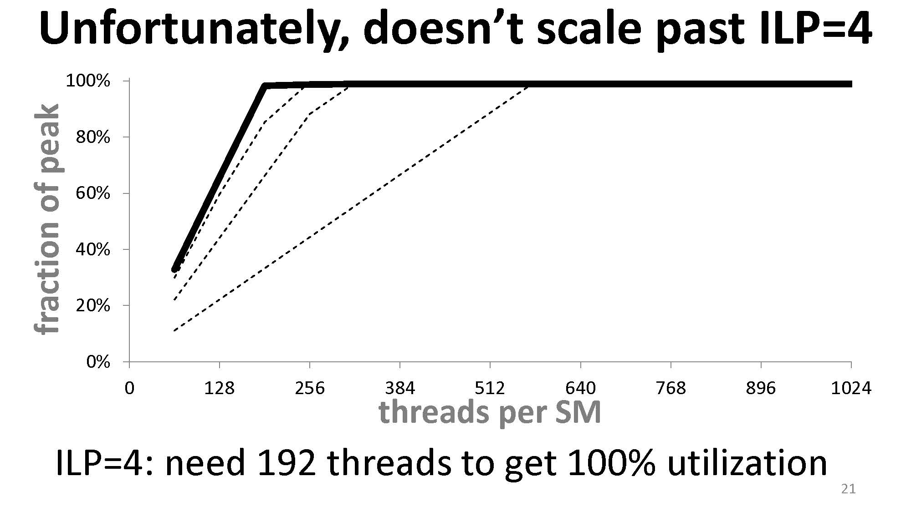
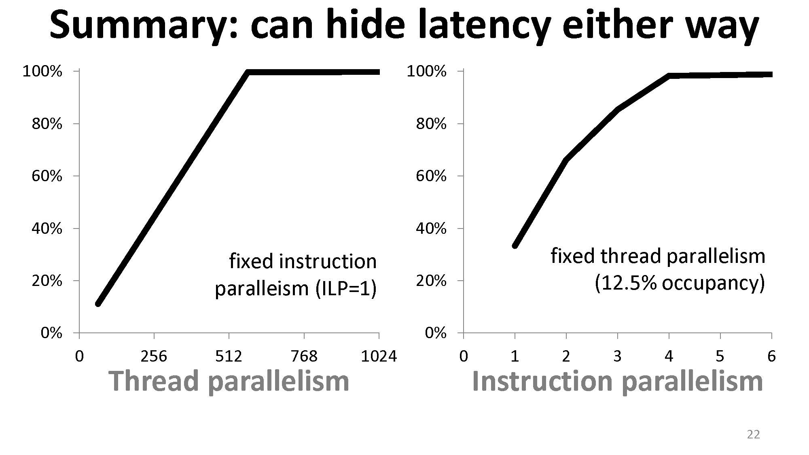
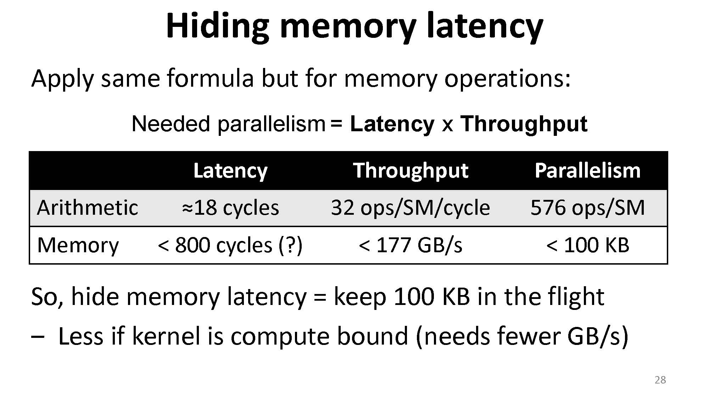
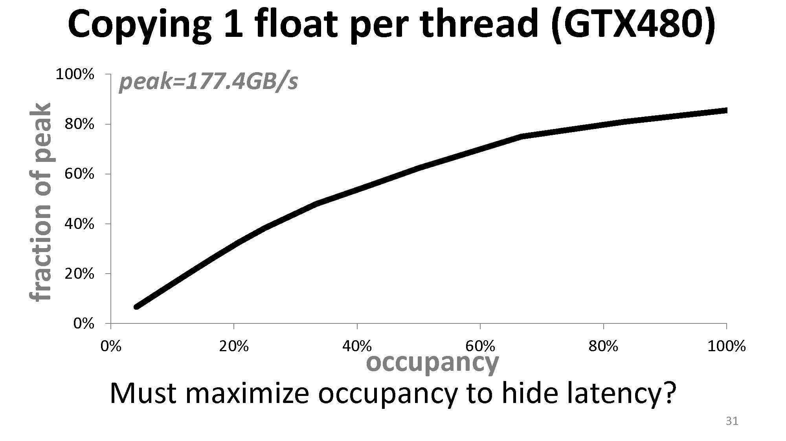
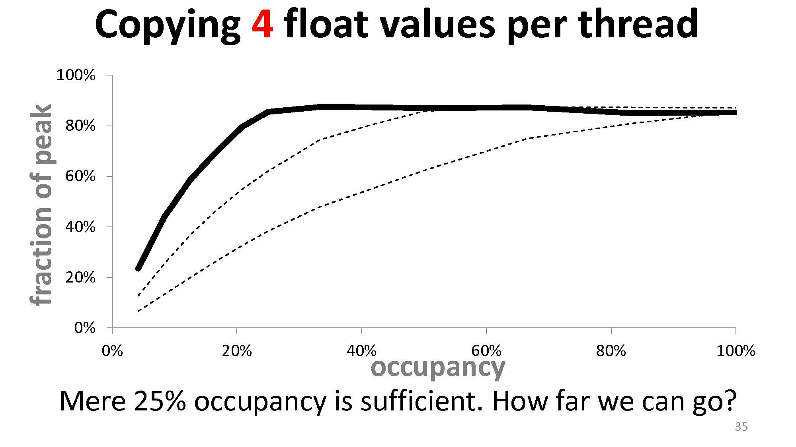
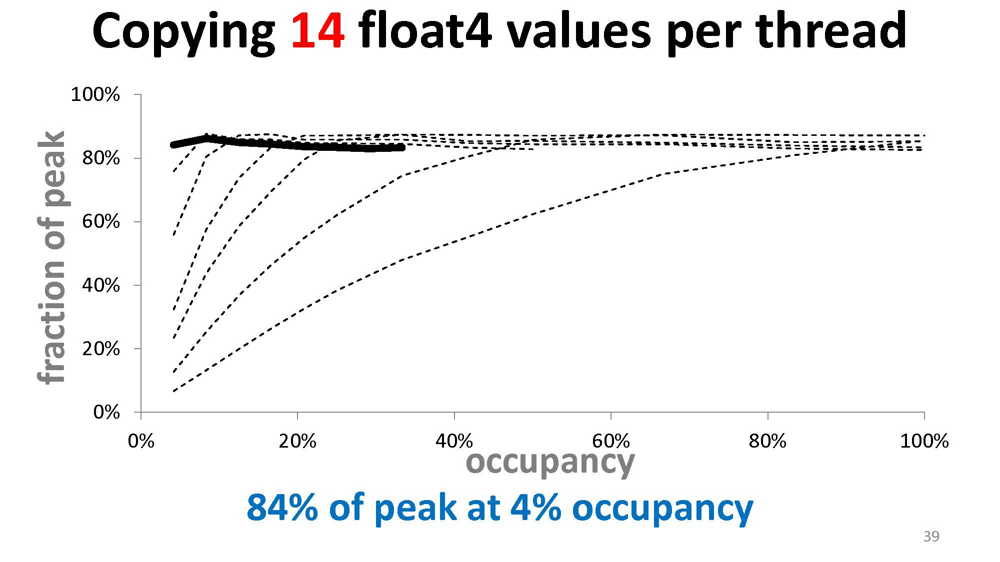
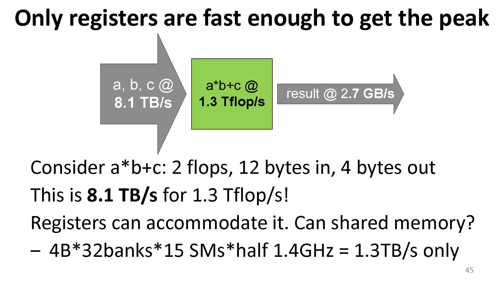
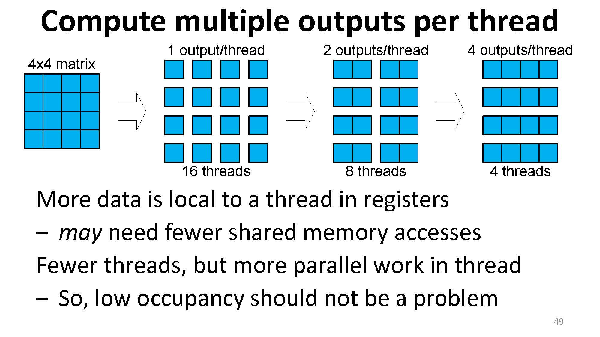

因为在实践过程中发现，occupancy 的高低似乎与性能没有绝对的联系，十分想探明背后的原因，所以进行了一番查询，找到了 [Better Performance at Lower Occupancy](https://www.nvidia.com/content/gtc-2010/pdfs/2238_gtc2010.pdf) 这个 talk（下面简称 talk）。这里是阅读并学习这一 talk 的笔记。

## 惯性的思维

我们一般认为要想令 CUDA kernel 性能高，occupancy 需要够高，因为这样保证了每个 SM 上有足够的线程，从而可以 hide lantencies。但是从我的[实际测试]()中看，事实并不是这样，这也是 talk 开篇就给出的事实：


## 线程少也能掩盖计算延迟

延迟（latency）是执行一个操作所需的时间，如果是算数操作可能会是 ~20 个时钟周期，内存操作则可能是 ~400 个时钟周期。所以当某个操作正在进行时，依赖于该操作的其他操作会被堵塞。想要掩盖这种延迟，可以通过执行其它操作来掩盖：


这里要注意延迟与吞吐量（throughput）的区别。

- 延迟是单个操作的速率，比如算数操作比内存操作快一百倍：算术操作需要 4 个时钟周期，而内存操作需要 400 个时钟周期，这里指的是延迟。
- 吞吐量则是每个周期能完成多少操作。如算数操作的吞吐量是 1.3 TFLOPS，假设我们的 GPU 的时钟速度是 1.386 GHz，那么我们可以算出这个吞吐量相当于 480 ops/cycle（这里一个 op 对应一次乘加，即两次 FLOP，算法是 $(1.3 * 1024) \text{ GFLOPS } / 2 / 1.386 \text{ GHz } \approx 480 \text{ ops/cycle}$）。同理，如果内存操作吞吐量是 177 GB/s，则可以计算出这个吞吐量相当于 32 ops/cycle（这里一个 op 对应一次 32-bit load，算法是 $177 \text{ GB/s } / 1.386 \text{ GHz } / 4 \text{ B } \approx 32 \text{ ops/cycle}$）。

虽然可以通过等待延迟时做其它操作来掩盖这一延迟，但是我们要注意到，整体的速度再快也不可能超过极限。这个极限可以用利特尔法则（Little's law）来计算。

利特尔法则的内容是：在一个稳定的系统中，长期的平均顾客人数（$L$），等于长期的有效抵达率（$\lambda$），乘以顾客在这个系统中平均的等待时间（$W$）；或者，我们可以用一个代数式来表达：$L = \lambda W$。

这一公式可以用来描述一个商店中顾客长期的平均人数：如果顾客的到达率 $\lambda$ 为每小时 10 人，平均每个顾客逛商店的时间 $W$ 是 0.5 小时，则商店中平均的顾客人数 $L$ 为 $10 \times 0.5 = 5$ 人。 

利特尔法则也可以用来描述一个应用程序的响应时间：$L$ 为平均工作数量，$\lambda$ 为平均吞吐量，$W$ 为平均响应时间（延迟）。

那么就很清楚了，我们所需要的并行程度（parallelism，有多少操作在这个系统中）= 延迟 * 吞吐量：


根据上图，我们要达到 100% 的吞吐量，就必须满足足够的并行度。图中一个 SM 有 8 个核，一个操作需要 24 个周期，则我们至少需要在一个 SM 上进行 $8 \times 24 = 192$ 次操作。如果数量不足，则我们得不到 100% 的吞吐量，有些时钟周期就会空转。（这里的理解是指令的执行是流水线的，所以每一个时钟周期都需要送新的指令进去，来满足这个流水线的执行。）

一般来说我们可以通过塞足够的线程来完成这一目标：


但是我们也可以通过单个线程中指令的并行来完成这一点：


举例对于下面的代码是没有 ILP 的情况：

```c++
#pragma unroll UNROLL 
for( int i = 0; i < N_ITERATIONS; i++ ) { 
  a = a * b + c; 
}
```

在 `N_ITERATIONS` 足够大， `a`、`b`、`c` 都在寄存器中，且 `a` 之后会被用到的情况下，这样的代码在 GTX 480 上需要 576 个线程来达到 100% 的算数吞吐量。

而在 ILP = 2 时，下面的代码

```c++
#pragma unroll UNROLL 
for( int i = 0; i < N_ITERATIONS; i++ ) { 
  a = a * b + c;
  d = d * b + c;
}
```

在实验中仅需要 320 个线程来达到 100% 的算数吞吐量。这证明了线程数量（TLP）之外，ILP 同样可以贡献算数吞吐量。最终直到 ILP = 4 后，ILP 能带来的贡献达到极限，仅需要 192 个线程。





所以总结：

- 增加 occupancy 并不是唯一可以进行 latency hiding 的方法，增加 ILP 程度也是。
- Occupancy 不是衡量硬件利用率的指标，它只是其中的一个 contributing factor。
- 为了完全掩盖计算延迟，并不需要一定让线程数量跑满（即最大 occupancy）。

## 线程少也能掩盖内存延迟

同理，对于内存延迟也是类似的。如下图的例子中，经过计算我们如果要掩盖掉内存延迟，需要时刻读取 100 KB。



那么我们可以用很多种方法来做到时刻读取 100 KB：

- 可以增加线程数。
- 可以用 ILP（每一个线程增加互不依赖的访存）.
- 可以用 bit-level parallelism（使用 64 位或 128 位的访存）

举例，对于下面的代码

```c++
__global__ void memcpy(float *dst, float *src) {  
  int block = blockIdx.x + blockIdx.y * gridDim.x; 
  int index = threadIdx.x + block * blockDim.x; 
  
  float a0 = src[index]; 
  dst[index] = a0; 
}
```

occupancy 与内存吞吐量之间的关系为：



而当我们增加拷贝 float 的数量时

```c++
__global__ void memcpy(float *dst, float *src) {  
  int iblock = blockIdx.x + blockIdx.y * gridDim.x; 
  int index = threadIdx.x + 2 * iblock * blockDim.x; 

  float a0 = src[index]; 
  // no latency stall 
  float a1 = src[index+blockDim.x]; 
  // stall due to data dependency
  dst[index] = a0; 
  dst[index+blockDim.x] = a1; 
}
```

达到同样内存吞吐量需要的 occupancy 就会下降。如果我们增加到拷贝 4 个 float

```c++
__global__ void memcpy(float *dst, float *src) 
{  
  int iblock = blockIdx.x + blockIdx.y * gridDim.x; 
  int index  = threadIdx.x + 4 * iblock * blockDim.x; 
  
  float a[4];//allocated in registers 
  for(int i=0;i<4;i++) a[i]=src[index+i*blockDim.x]; 
  for(int i=0;i<4;i++) dst[index+i*blockDim.x]=a[i]; 
}
```

则会变成这样：



我们还可以把拷贝 float 变成拷贝 float2 或 float4 来进一步降低需要的 occupancy：



所以，与掩盖计算延迟同理，想要掩盖内存延迟，可以提升 occupancy，也可以提升每个线程访存的量。

总结：低 occupancy 与低线程数并不绝对地意味着掩盖不了内存延迟，并不绝对地意味着内存吞吐量低。

## 用更少的线程让程序更快

首先我们要理解寄存器的重要性。比如对于一个式子 $a * b + c$，需要两个浮点操作，加载 3 个浮点数，并输出 1 个浮点数。如果算数吞吐量是 1.3 TFLOPS，则加载这个浮点数的内存吞吐量至少需要 $1.3\text{ TFLOPS} / 2 * 12\text{ B} = 7.8 \text{ TB/s}$（我不知道下面这个 8.1 TB/s 作者是咋算出来的）。但是 shared memory 不能提供这么高的吞吐量。



而只有寄存器可以支持这么高的内存吞吐量：


而如果需要给每个线程分配更多的寄存器，则线程数量就需要减少，occupancy 也会随之减少，但是每一次计算所需的内存吞吐量可以获得提升。

这也解释了 thread coarsening 能获得性能提升的一个重要理由：一个线程负责更多的输出，可以使得更多的数据被搬到寄存器上，shared memory 的访问也会减少，从而提升算数计算的效率。



## Case study：GEMM

请参考 [GEMM 优化]()这一篇文章。
