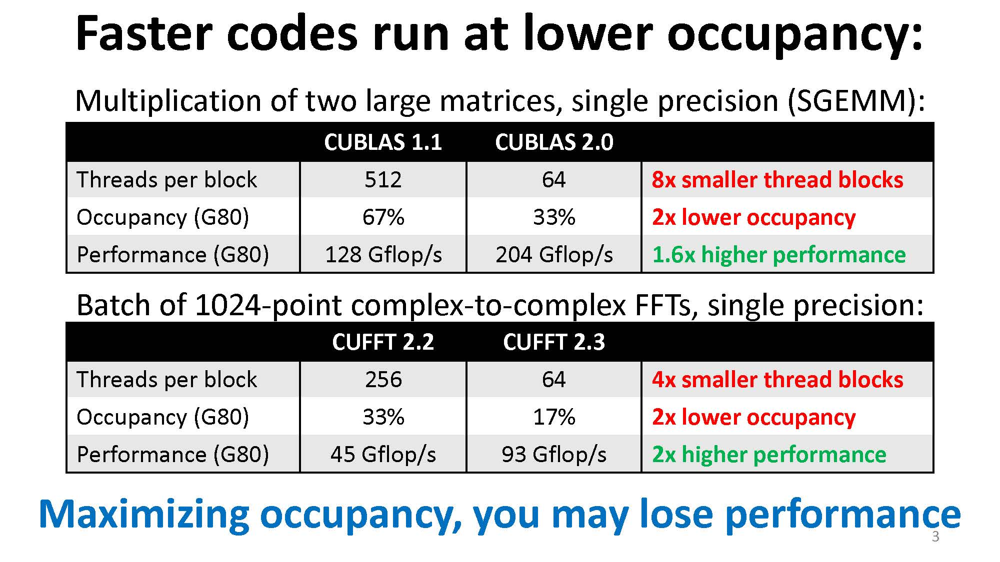
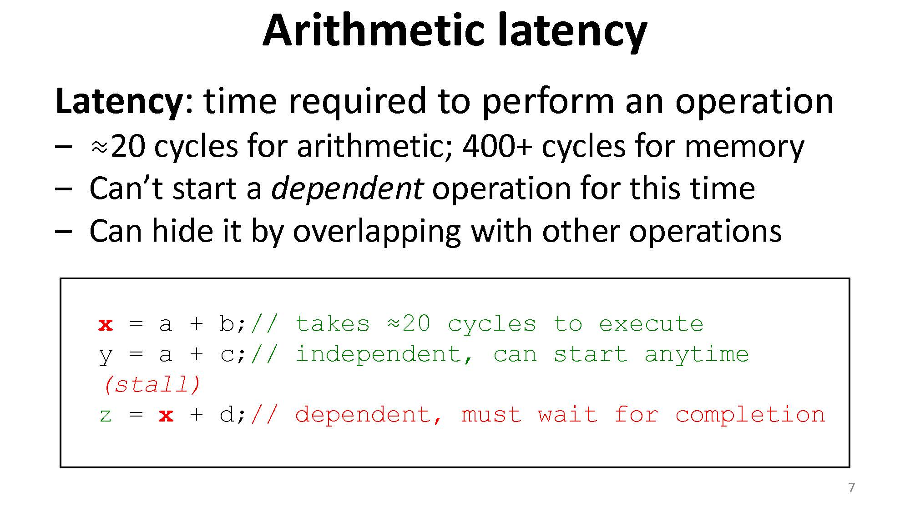
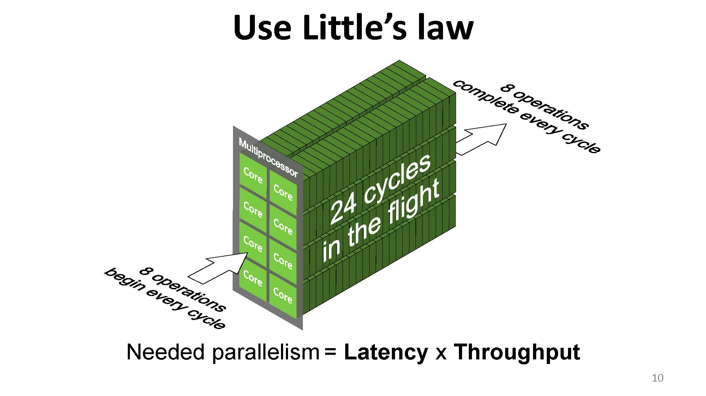
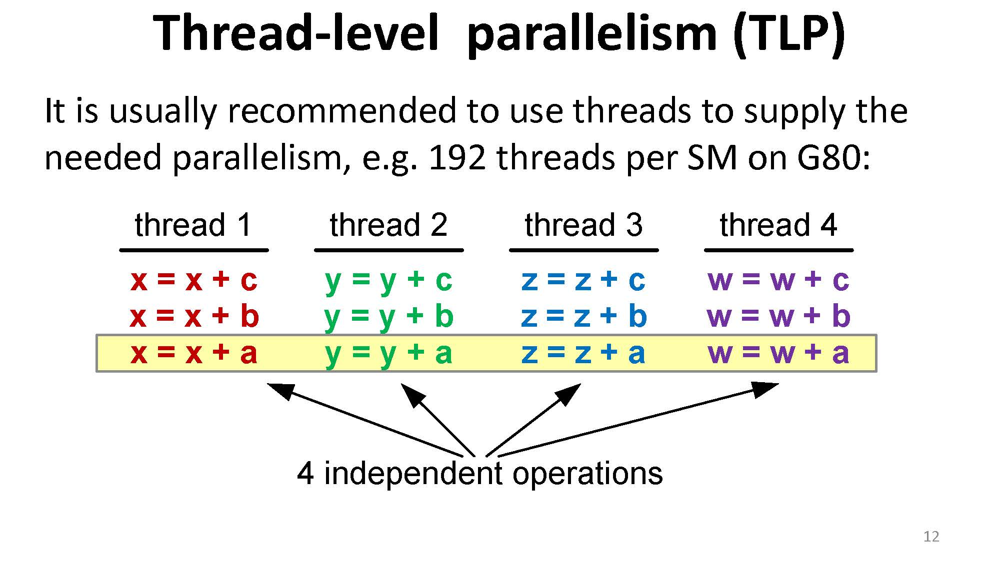
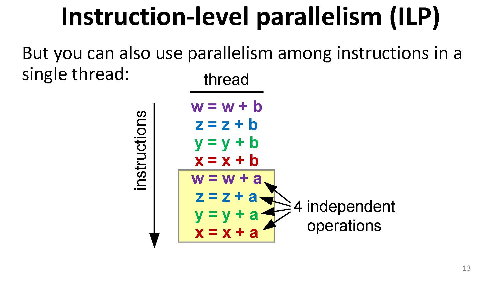

因为在实践过程中发现，occupancy 的高低似乎与性能没有绝对的联系，十分想探明背后的原因，所以进行了一番查询，找到了 [Better Performance at Lower Occupancy](https://www.nvidia.com/content/gtc-2010/pdfs/2238_gtc2010.pdf) 这个 talk（下面简称 talk）。这里是阅读并学习这一 talk 的笔记。

## 惯性的思维

我们一般认为要想令 CUDA kernel 性能高，occupancy 需要够高，因为这样保证了每个 SM 上有足够的线程，从而可以 hide lantencies。但是从我的[实际测试]()中看，事实并不是这样，这也是 talk 开篇就给出的事实：

## 在线程更少时掩盖计算延迟

延迟（latency）是执行一个操作所需的时间，如果是算数操作可能会是 ~20 个时钟周期，内存操作则可能是 ~400 个时钟周期。所以当某个操作正在进行时，依赖于该操作的其他操作会被堵塞。想要掩盖这种延迟，可以通过执行其它操作来掩盖：

这里要注意延迟与吞吐量（throughput）的区别。

- 延迟是单个操作的速率，比如算数操作比内存操作快一百倍：算术操作需要 4 个时钟周期，而内存操作需要 400 个时钟周期，这里指的是延迟。
- 吞吐量则是每个周期能完成多少操作。如算数操作的吞吐量是 1.3 TFLOPS，假设我们的 GPU 的时钟速度是 1.386 GHz，那么我们可以算出这个吞吐量相当于 480 ops/cycle（这里一个 op 对应一次乘加，即两次 FLOP，算法是 $(1.3 * 1024) \text{ GFLOPS } / 2 / 1.386 \text{ GHz } \approx 480 \text{ ops/cycle}$）。同理，如果内存操作吞吐量是 177 GB/s，则可以计算出这个吞吐量相当于 32 ops/cycle（这里一个 op 对应一次 32-bit load，算法是 $177 \text{ GB/s } / 1.386 \text{ GHz } / 4 \text{ B } \approx 32 \text{ ops/cycle}$）。

虽然可以通过等待延迟时做其它操作来掩盖这一延迟，但是我们要注意到，整体的速度再快也不可能超过极限。这个极限可以用利特尔法则（Little's law）来计算。

利特尔法则的内容是：在一个稳定的系统中，长期的平均顾客人数（$L$），等于长期的有效抵达率（$\lambda$），乘以顾客在这个系统中平均的等待时间（$W$）；或者，我们可以用一个代数式来表达：$L = \lambda W$。

这一公式可以用来描述一个商店中顾客长期的平均人数：如果顾客的到达率 $\lambda$ 为每小时 10 人，平均每个顾客逛商店的时间 $W$ 是 0.5 小时，则商店中平均的顾客人数 $L$ 为 $10 \times 0.5 = 5$ 人。 

利特尔法则也可以用来描述一个应用程序的响应时间：$L$ 为平均工作数量，$\lambda$ 为平均吞吐量，$W$ 为平均响应时间（延迟）。

那么就很清楚了，我们所需要的并行程度（parallelism，有多少操作在这个系统中）= 延迟 * 吞吐量：

根据上图，我们要达到 100% 的吞吐量，就必须满足足够的并行度。图中一个 SM 有 8 个核，一个操作需要 24 个周期，则我们至少需要在一个 SM 上进行 $8 \times 24 = 192$ 次操作。如果数量不足，则我们得不到 100% 的吞吐量，有些时钟周期就会空转。（这里的计算不是很确定，需要后面修订！）

一般来说我们可以通过塞足够的线程来完成这一目标：

但是我们也可以通过单个线程中指令的并行来完成这一点：

