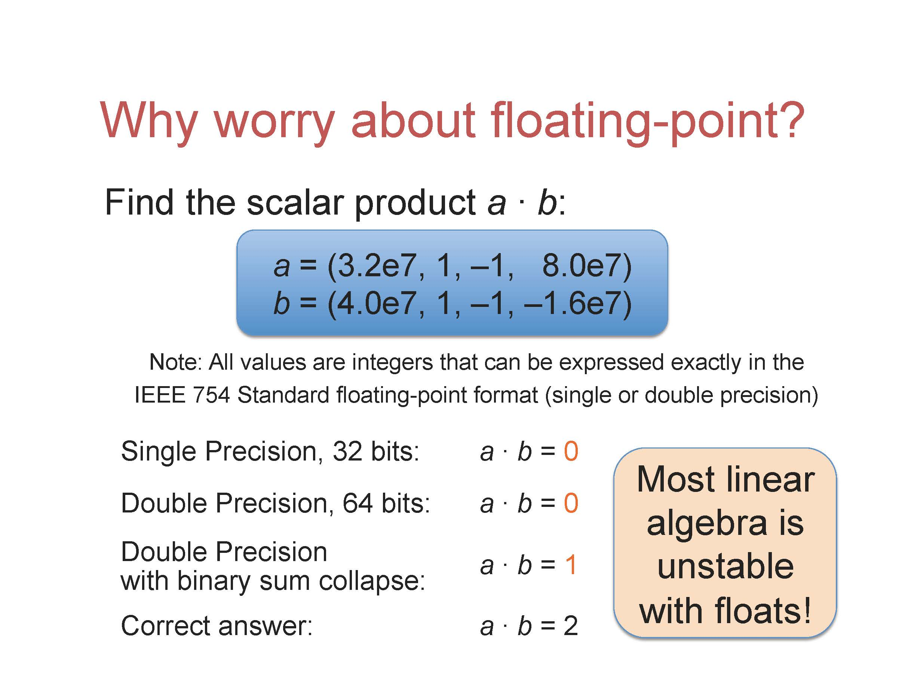
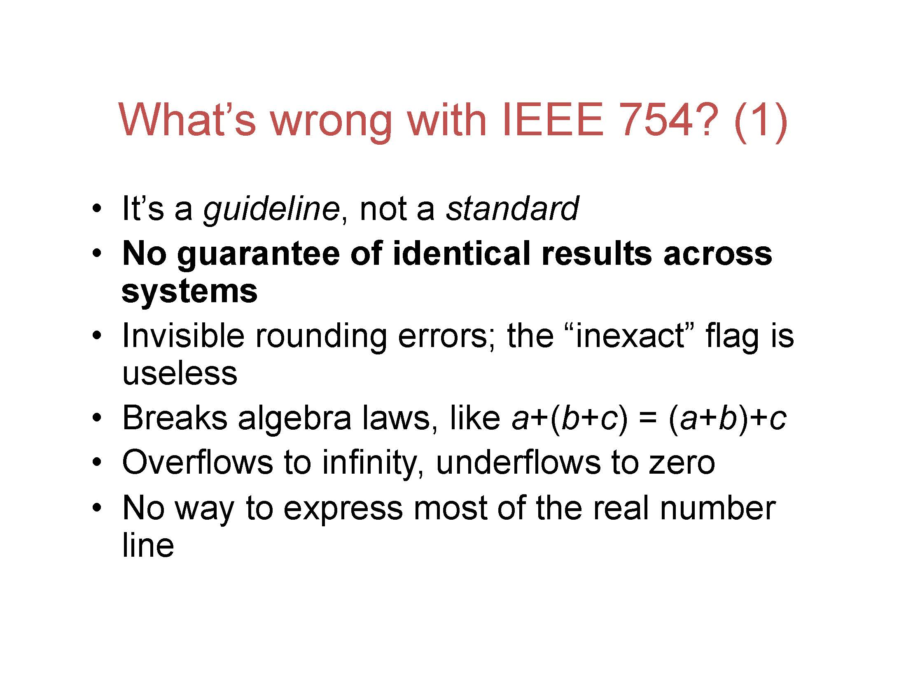
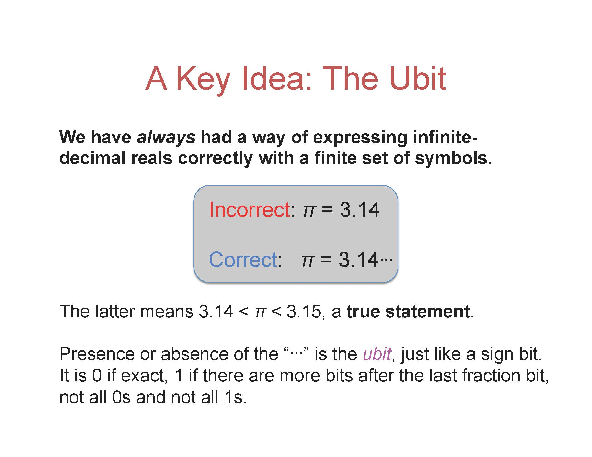
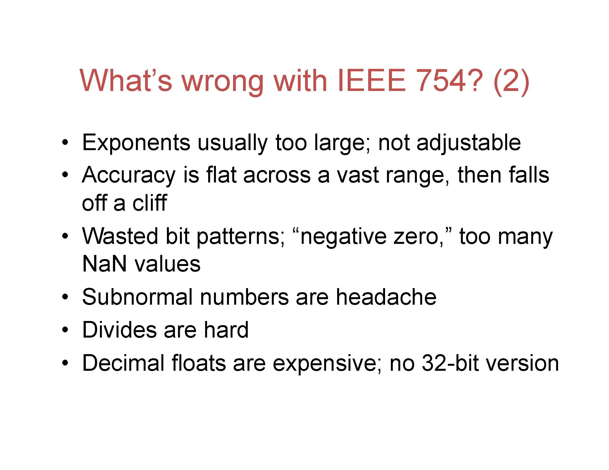
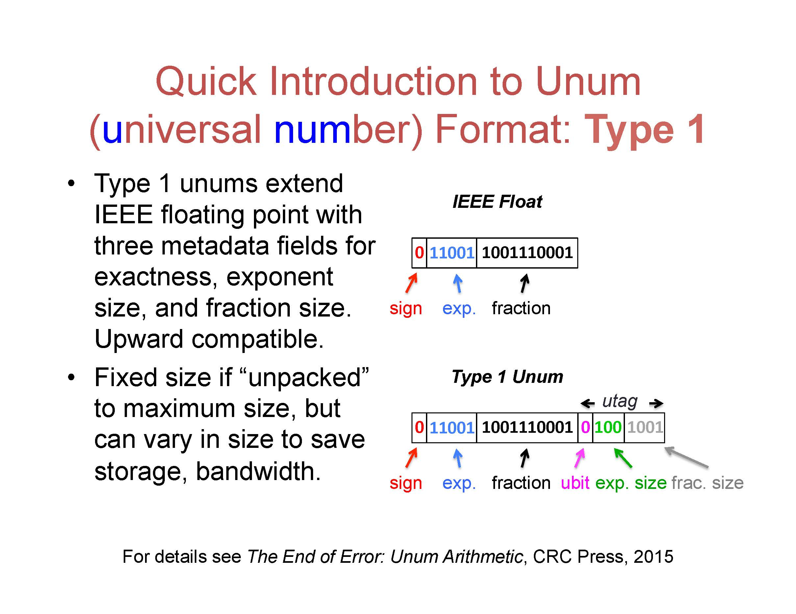
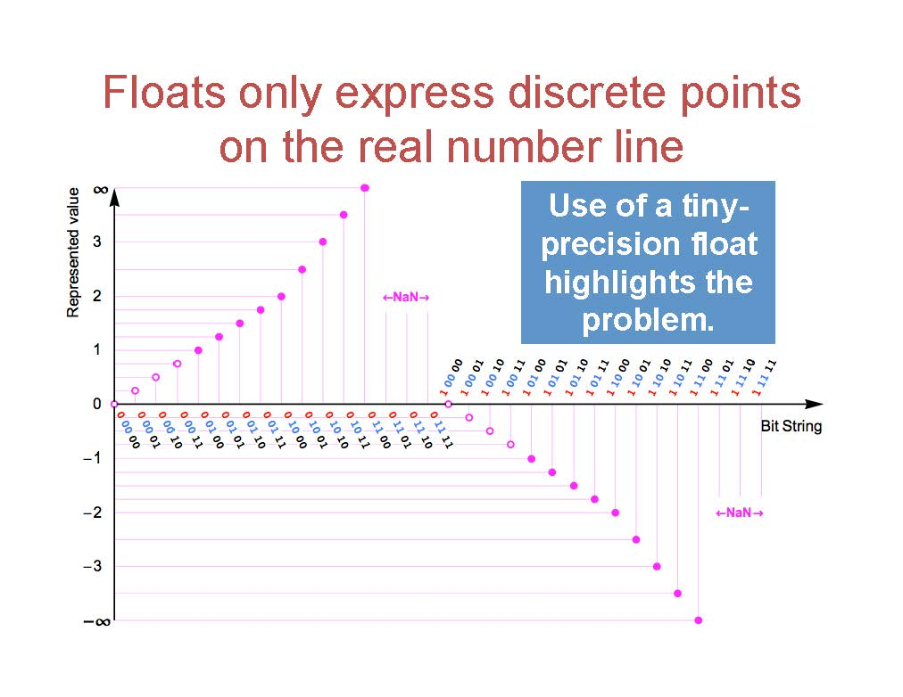
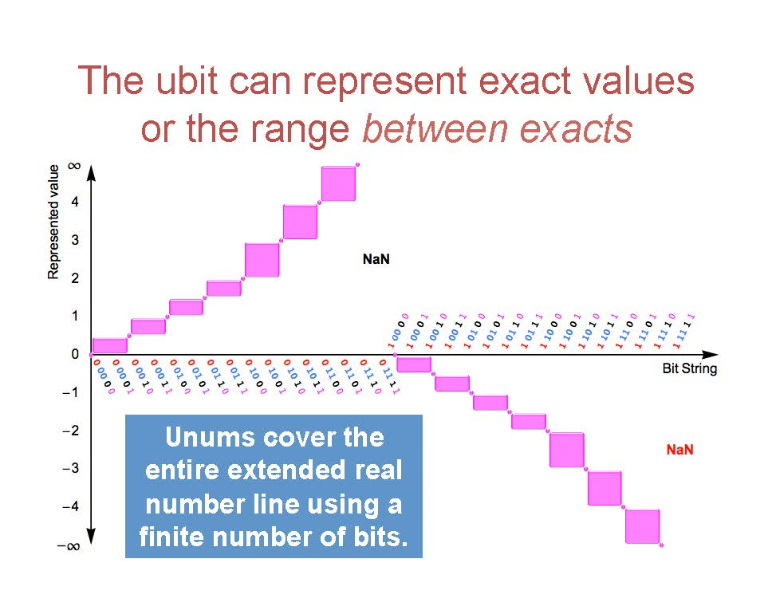
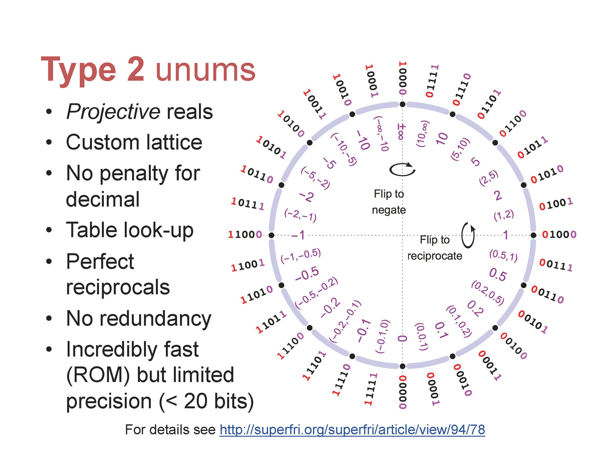
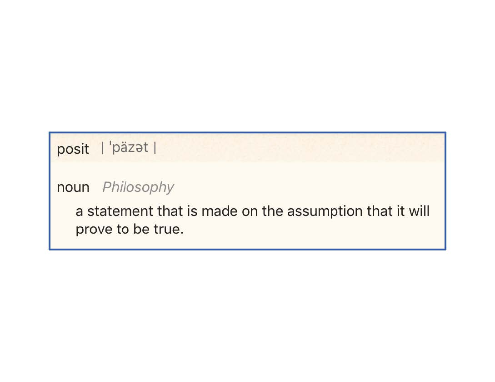
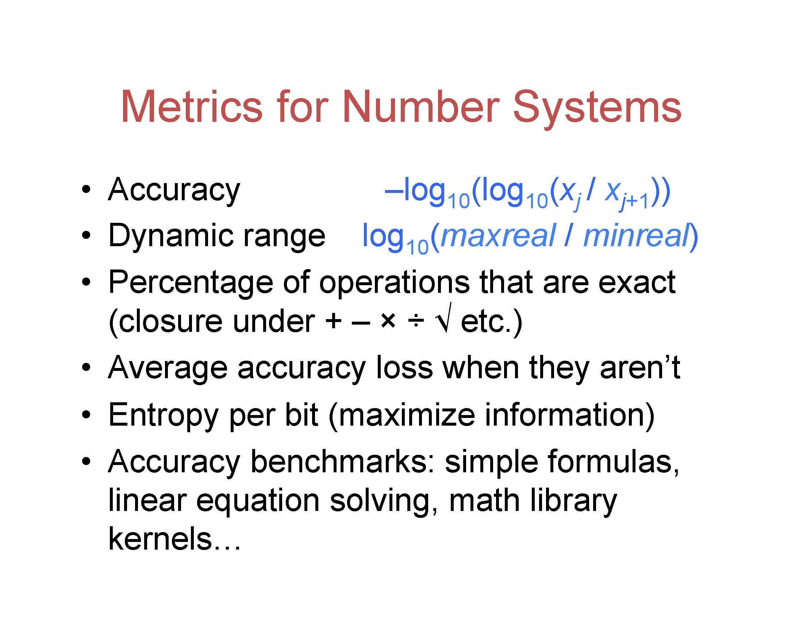

由于读博士期间不停地被浮点数精度所折磨，所以想要学习相关的内容。这里记录关于 posit 格式——作者认为可以用来替换 IEEE 754 浮点数的格式——的学习笔记。下面是 2017 年该论文的作者之一 Dr. John L. Gustafson 在斯坦福进行的演讲。该演讲是斯坦福 EE 计算机系统课程的一部分（实名羡慕）。

## 背景

### 现有浮点数的问题

开篇作者便讲了现有浮点数最大的问题：计算的不稳定性。

And there's more。

关于这里的最后一点，大多数实数无法被表示，其实这里想表达本质上现有的浮点数是一个 quantization，它只是把实数用靠近它的一个数值来表示。

所以关于这一点，作者说他的想法是需要有一个 bit 来表达这个数是不是被精确表达了。就像我们写 $\pi = 3.14$，这其实是不对的，但是我们如果在后面加上一个省略号，即 $\pi = 3.14\cdots$，那这就是正确的了，这表达了后面还有很多位数字我们无法表达。

还有更多的问题。

### Unum Format Type 1

Unum 代表 universal number，是作者于 2015 年提出的一种格式。这个格式在 IEEE 754 上增加了三个 metadata，表示 ubit、指数和尾数的 size。

Ubit 带来的一个重要的区别是，相比之前的浮点数只能表达一个固定点，现在浮点数可以表达一个区间。

### Unum Format Type 2

作者接下来又提出了一种新的格式，令实数轴首尾相接，即正负无穷在一个点。同时一个好处是现在 x 和 1/x 是上下对称的（见下图），这使得乘法和除法之间的区别消失。

但是这个方法的缺点是，用现有的电路来计算很难。所以作者使用了一种查表的方式进行计算。虽然这样也可以，但是作者还是想得到一种能不查表的方法。

## Posit 格式

Posit，作为单词的意思是“假设”，用作推定后面的事情。比如我们假设 A 是正确的，那么我们会有 B。这里的 A 就是一个假设。作者说因为之前他管这些叫“猜”（guesses），但是觉得需要一个更好的词（hhh）。

在平均一个 number system 之前，我们先确定评价的标准，大概包括下面几个方面：

