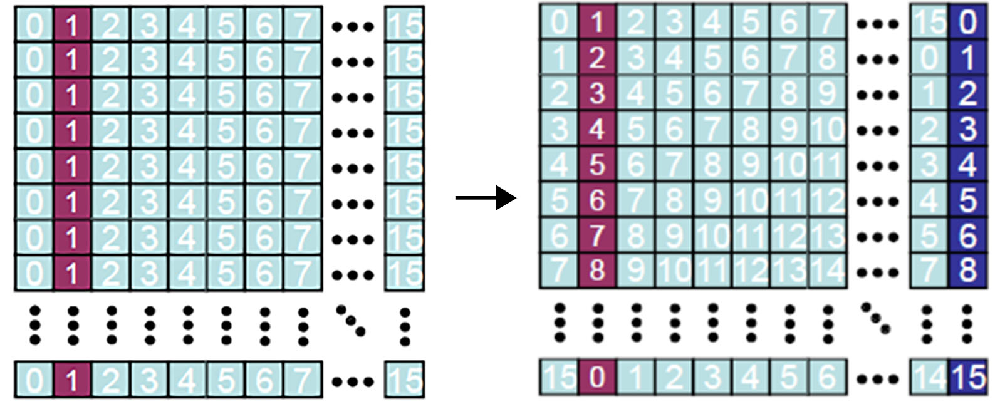
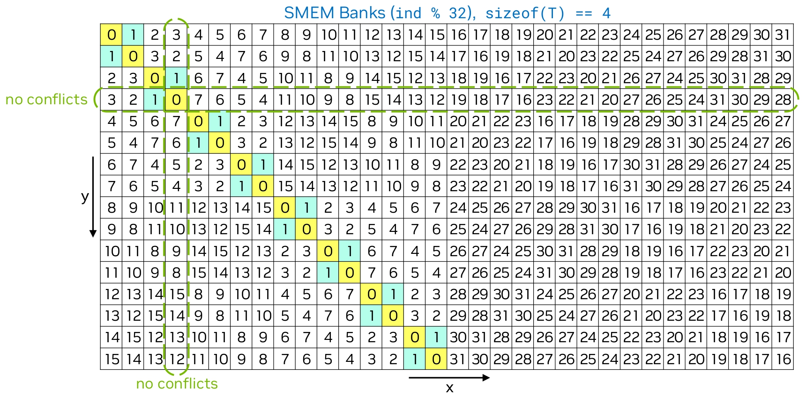

[CUDA shared memory bank conflict](https://leimao.github.io/blog/CUDA-Shared-Memory-Bank/) 是会造成 shared memory 访问延迟的一个原因。这篇主要介绍两种消除 CUDA bank confict 的方法，分别为 memory padding 与 swizzling。

我们以矩阵转置为例，如果我们设定 block 的大小为 $32 \times 32$，每个 block 对 GMEM 中这个矩阵 $32 \times 32$ 的一小块进行转置。则这个 block 中的线程需要集体从 GMEM 中将矩阵搬运至 SMEM（不转置的搬运），并在转置后存储到 GMEM。注意在 SMEM 中，矩阵是没有转置的。所以在后面存储至 GMEM 时，我们需要一次读取 SMEM 中的一列数据，写入 GMEM 的一行中。

可以看到这一过程在 shared memory 中会有很强的 bank confict，因为在转置后，所有的线程都在读同一列，而这里因为大小是 $32 \times 32$，所以这一列都是同一个 bank。那么问题的根源就是破除掉这个整除的关系，即所有的线程因为整除的关系，全部被分配到了同一个 bank 进行读写。其中第一个方案是从分配空间的角度去考虑，即 memory padding。

## Memory padding

Memory padding 是很简单地在开辟 shared memory 空间时，多开辟一个空间，如本来的代码为：

```c++
__shared__ T shm[BLOCK_TILE_SIZE_Y][BLOCK_TILE_SIZE_X];
```

可以改为

```c++
__shared__ T shm[BLOCK_TILE_SIZE_Y][BLOCK_TILE_SIZE_X + 1];
```

这样做可以令我们维持原有的序号进行访问，并错开实际的存储 bank。原理如下图：



## Swizzling

Swizzling 的本质是改变线程到 shared memory 的索引，使得 bank 访问错开。比如对于我们上面的从 GMEM 读到 SMEM 的操作，我们可能是直接使用 `threadIdx.y` 和 `threadIdx.x` 来作为 shared memory 的索引的：

```c++
size_t const input_matrix_from_idx_x{threadIdx.x + blockIdx.x * blockDim.x};
size_t const input_matrix_from_idx_y{threadIdx.y + blockIdx.y * blockDim.y};
size_t const input_matrix_from_idx{input_matrix_from_idx_x + input_matrix_from_idx_y * N};

size_t const shm_to_idx_x{threadIdx.x};
size_t const shm_to_idx_y{threadIdx.y};

shm[shm_to_idx_y][shm_to_idx_x] = input_matrix[input_matrix_from_idx];
```

这样一列数据就都存到了 bank 0 中。然而我们可以使用一个异或来进行错开：

```c++
size_t const input_matrix_from_idx_x{threadIdx.x + blockIdx.x * blockDim.x};
size_t const input_matrix_from_idx_y{threadIdx.y + blockIdx.y * blockDim.y};
size_t const input_matrix_from_idx{input_matrix_from_idx_x + input_matrix_from_idx_y * N};

size_t const shm_to_idx_x{threadIdx.x};
size_t const shm_to_idx_y{threadIdx.y};
size_t const shm_to_idx_x_swizzled{(shm_to_idx_x ^ shm_to_idx_y) % BLOCK_TILE_SIZE_X};

shm[shm_to_idx_y][shm_to_idx_x_swizzled] = input_matrix[input_matrix_from_idx];
```

下图中每个方块中的数字就是 `shm_to_idx_x_swizzled`，也就是存储时的列号。可以看到，原本的第 0 列被存成了对角线，这样子我们再从 SMEM 中读出第 0 列时，我们会进行一个对角线读取，最小化 bank conflict（这个性质的证明在[这里](https://leimao.github.io/blog/CUDA-Shared-Memory-Swizzling/)）。对其他列也是同理。


