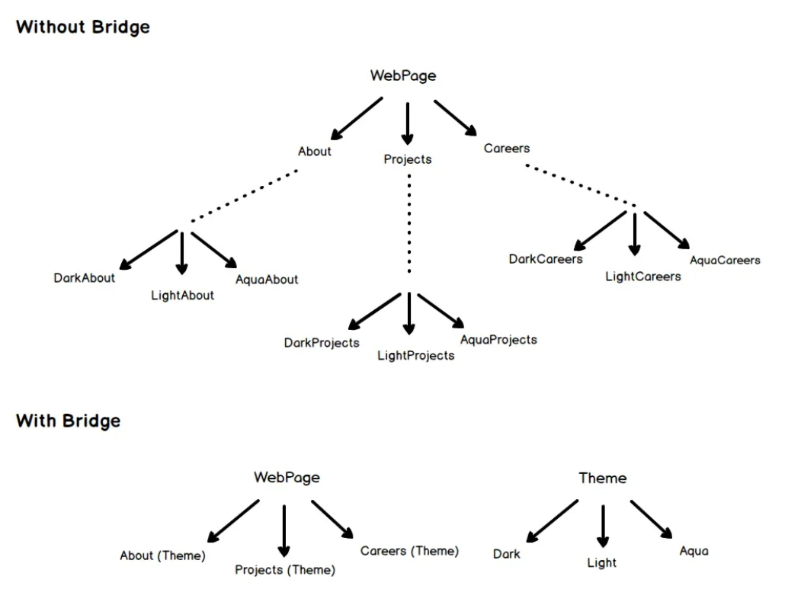

一直感觉没有系统地梳理过设计模式，依据[Design patterns for humans](https://github.com/kamranahmedse/design-patterns-for-humans)和一个非常好的[翻译版](https://segmentfault.com/a/1190000010706695#item-4-25)，我在这里简要地梳理一下这些设计模式的本质。

## 概述

最早的设计模式中有一些其实可能在现在已经太普遍了很难让人觉得是设计模式，或者有一些可能会被认为只是对一类编程技巧的称呼，只是因为用到了 OOP 特性变成了设计模式，还有一些甚至已经被语言吸收变成语言特性了。所以在这里先进行一个总结性的分类。

- 创建型：
  - 替代复杂的构造函数或构造逻辑：工厂、抽象工厂、生成器；
  - 已经成为语言特性：原型（C++ 中的拷贝构造和拷贝赋值）；
  - 一些特定场景下需要的编程技巧：单例（一个只能有一个实例的类）；
- 结构型：
  - 通过添加中间层来实现额外功能：适配器（通过添加中间层类让新类兼容旧接口）、外观（通过添加中间层类简化复杂接口）、代理（通过添加中间层类替换原先的类，实现添加功能或其它目的）；
  - 在接口的子类过多时，通过剥离新的抽象维度，并以组合而非继承的形式降低耦合度：桥接；
  - 同一接口的子类通过互相拥有来形成层级结构和递归的操作：组合、装饰；
  - 一些特定场景下需要的编程技巧：享元（将大量对象中重复存储的数据抽出单独存储，通常存储在哈希表中）；
- 行为模式：
  - 将具体逻辑交给子类，通过子类的变化来完成不同的行为：策略（具体逻辑在 Strategy 类中，一般描述同一件事的不同完成方式，由 Caller 类调用）、状态（具体逻辑在 State 类中，来源是状态自动机的状态变化，与策略相比 Strategy 类一般互相是独立的，彼此不知道相互的存在，而 State 类之间一般知道互相的存在，甚至会发生互相的转变）、命令（具体逻辑在 Command 类中，Command 类对象可以被放在队列中或交给其它类执行，从而灵活地实现行为，可认为是 Strategy 类的更灵活的扩展）；
  - 通过依赖注入与回调实现控制反转与解耦：中介者（所有的类都与一个中心的 Mediator 类沟通，由 Mediator 类操纵其它类的行为，目的是减少各类之间错综复杂的依赖关系）、观察者（消息订阅的范式，除了用来做消息订阅之外还可以用来实现中介者模式，但是不像中介者模式那样要求一个强中心类的存在，可以多个发布者和订阅者之间直接沟通）、访问者（每个类可以接受一个 Visitor 类的对象，这个对象包含了对这些类的操作，从而实现对类的行为的方便的扩展）
  - 已经成为语言特性：迭代器（C++ 中的迭代器）；
  - 一些特定场景下需要的编程技巧：责任链（将对象形成链表，然后通过顺序访问来决定行为顺序）、备忘录（让一个类在不暴露实现细节的情况下保存和恢复其状态）、模板方法（用接口来规定算法通用的部分，让子类实现不同的特定步骤）。

## 简单类

### 创建型（Creational）

#### 生成器（Builder）

当我们有下面这样一个复杂的构造函数时，我们会发现这样的构造形式是不可持续的。

```c++
Burger(int size, bool cheese = true, bool peperoni = true, bool tomato = false, bool lettuce = true);
```

我们可以用一个生成器来完成这个过程：

```c++
    Burger* burger = Burger::BurgerBuilder(14).AddPepperoni().AddLettuce().AddTomato().Build();
```

这里的本质是将构造函数中的参数列表*方法化*了。

#### 原型（Prototype）

通过克隆, 基于已有对象来创建对象。本质就是 C++ 的拷贝构造和拷贝复制。

### 结构型（Structural）

#### 适配器（Adapter）/ 外观（Facade）/ 代理（Proxy）

这三个模式本质都是通过中间加一层来实现额外功能，适配器模式是为了实现不同类之间的兼容，外观模式是为了简化复杂接口，代理模式是为了增强一个类的功能。

- 适配器模式的本质是如果一些代码只接受某个类 A 作为参数，当我们需要增加一个新类 B 来兼容这些操作时，可以用一个 Adapter 类（中间层）来作为原先类 A 的子类，然后用类 B 的逻辑来实现。比如 microSD 需要一个 SD 转换器来插入电脑的 SD 接口。这个的重点是，客户端还会认为自己在使用类 A。
- 外观模式的本质是把复杂的业务逻辑包装成一个单独的 Facade 类（中间层）和对应的简单方法，比如把电脑开机的过程只包装成一个 Computer 类和 TurnOn() 方法，在内部执行起电、自检、调用加载动画等一系列逻辑。
- 代理模式可以被视为放松要求的适配器，只是适配器是严格遵守了需要被兼容的那个类（类 A）的接口，代理模式没有这种要求，只是接口*类似于*原先的接口。当然也许这两个类的接口可以被一个抽象类确定，从而这两个类（类 A 和 Proxy 类）的接口可以完全一致，这样更容易兼容。代理模式和适配器模式最根本的区别是，客户端是明确地知道自己在使用 Proxy 类（中间层）来执行业务逻辑的。

#### 享元（Flyweight）

如果类 A 的多个对象拥有相同的状态，可以把这些状态抽出来变成一个新的类 SharedState，这样原先类 A 的多个对象可以指向同一个 SharedState 对象即可，从而节省内存。这个模式称为享元。一般共享的这个 SharedState 可能会存储在哈希表里方便查找。

### 行为模式（Behavioral）

#### 责任链（Chain of Responsibility）

责任链有点像在学校请假。请假需求先找导师签字，导师通过行政老师签字，行政老师通过院长签字，等等。如果某一个环节打回来了，那就重新来。就像这样的一个对象一个对象检查过去的模式，每个对象可以选择自己处理，或者交给责任链上的下个责任人（当然，也可以都做了，比如上面的自己签字然后再交下去）。实现形式是所有类都继承同一个接口，每个类都有一个该接口的指针，指向链上的下一个对象。

当然，话说回来了，如果没有这样一个指针，把这些对象按顺序放在一个 vector 里，那效果也是一样的。只能说在具体实现的时候要足够灵活。

#### 迭代器（Iterator）

C++ 语言特性。如果用 std 容器，这个迭代器本身就包含了。但是很多时候为了效率，迭代器并不是很好的方案。它的目的是包装访问容器内元素的方法，但是这个方法又有什么好包装的呢……

#### 备忘录（Memento）

备忘录模式的本质就是缓存这个行为的对象化。比如我们现在想要把一些类当前的状态存下来，我们应该怎么办呢，类里面的很多数据可能是 private，是访问不到的。这时我们就应该创建一个 Memento 类，这个类是由 Originator 类（也就是我们想要保存其状态的类）创建的，因为它自己当然能访问自己的数据了。而 Originator 可以保存出来一个 Memento 类对象，也可以接收一个 Memento 类对象，来恢复自己的状态。而这个 Memento 类只需要对外暴露一些接口，也不必要把所有的数据暴露出来。

#### 模板方法（Template Method）

模板方法的本质是，大的业务逻辑是定死的，而小的业务逻辑可以改变。比如造房子必须遵循以下的步骤：

1. 建造地基；
2. 砌墙；
3. 建造屋顶。

但是这里面具体的实现可以变化，比如砌墙可以用石块，也可以用砖块。这些由具体的子类负责。相当于抽象类中确定了共同的逻辑，而可以变化的部分由子类进行具体的实现。

## 重点关注类

### 创建型（Creational）

#### 简单工厂（Simple Factory）/ 工厂（Factory）/ 抽象工厂（Abstract Factory）

简单工厂本质上只是提供了一个构造对象的接口。不使用构造函数，而是使用这个接口的理由是，有时使用构造函数之前步骤很多很复杂，为了提供一个简洁的接口，使用简单工厂。如

```c++
IDoor* door = DoorFactory::MakeDoor(100, 200);
```

工厂则是适合用户需要不同的门的时候，可以调用不同的工厂，如

```c++
DoorFactory* woodenDoorFactory = new WoodenDoorFactory();
woodenDoorFactory->MakeDoor(100, 200);

DoorFactory* ironDoorFactory = new IronDoorFactory();
ironDoorFactory->MakeDoor(100, 200);
```

这时如果说 `IDoor` 类已经是一个抽象了，那么可以看到，这时抽象的维度从一维上升到了二维，多了一维创造对象方法的抽象。这层抽象使得我们之后想要扩展门的类型和创建方法的时候，可以更为简单。

抽象工厂沿着这个思路就是抽象的维度又上升了一维，即不是一类型的门对应一类型的工厂，而是工厂本身也是抽象的。如一个工厂可能由好几个部门组成。造木门的需要木工和刷漆部门，但是造铁门除需要铁工外，也需要刷漆部门。对于一个可能维度有很多的对象来说，这样子我们也能通过组合来灵活地获得工厂，从而制造我们需要的对象。如

```c++
IDoorFactory* woodenFactory = new DoorFactory<WoodenDoor, Carpenter>();
{
    IDoor* door = woodenFactory->MakeDoor();
    IDoorFittingExpert* expert = woodenFactory->MakeFittingExpert();
    door->GetDescription();
    expert->GetDescription();
}

IDoorFactory* ironFactory = new DoorFactory<IronDoor, Welder>();
{
    IDoor* door = ironFactory->MakeDoor();
    IDoorFittingExpert* expert = ironFactory->MakeFittingExpert();
    door->GetDescription();
    expert->GetDescription();
}
```

#### 单例（Singleton）

一个类只会有一个对象的模式，非常适合存储需要全局存在并只允许存在一个的对象。

### 结构型（Structural）

#### 组合（Composite）

组合模式的目的是把对象组织成树状结构，这样我们调用最上层或中间某一层的对象使一系列的对象进行同样的操作。如我们需要调动军队，只需要告诉最高级的指挥官，他会命令他下属的指挥官们，下属的指挥官们再一级级向下传达。在程序中最常见的是 GUI 组件上的层级结构，如事件的捕捉和响应。代码实现参考[这里](https://refactoringguru.cn/design-patterns/composite/cpp/example#lang-features)。

#### 装饰（Decorator）

装饰模式很有意思，它就像那种俄罗斯套娃一样，所有的类都会继承自同一个接口，并且都有一个接受一个这个接口的构造函数。这个构造函数就相当于接收一个原来已经套了的娃，然后构造结束之后就又套了一层。用计算机的话说，类似递归的感觉。在这样的设计下，很多需要用递归来进行操作的逻辑就很好操作了。

另外，这个模式和上面的组合有啥区别？我觉得……没啥区别，只是两种形式吧（笑）。

#### 桥接（Bridge）

桥接是在代码重构中会经常使用的模式。比如有一个抽象类，下面有几个子类，一直工作的也很好，但是随着系统的扩张，子类越来越多，这时我们发现这个数量已经很难再维护了，我们需要提升一些抽象的维度了。这时我们会对现有子类中一些共通的部分抽出来，并且不以继承，而以组合的形式给到原先的类。如下图：



这个模式叫 bridge 的原因也是想要 “bridge a gap between the Abstraction and the Implementation”。我的理解就是单纯的抽象和子类这种写法只能在一些情况下满足我们的需求，有一些情况是不满足我们实际需求的。而这个问题，即 “gap”，怎么办呢，只能由桥接模式来 “bridge” 了。

### 行为模式（Behavioral）

#### 命令（Command）

命令模式还是值得好好学习一下的，它是把业务逻辑包装在一个 Command 接口类的子类中。负责调用的类会接收一个 Command 接口类对象，并执行其内在逻辑。举例，我们写一个软件有很多种方法来做同一种操作，比如复制我们可以点菜单栏中的按钮，可以用键盘上的 Ctrl+C，也可以右键菜单点击。这个时候我们是不希望把重复的逻辑来回写的。这个时候不同的 UI 控件或者响应就是不同的发送者（命令的发起者），如果命令很简单也许不需要接收者，命令直接就可以被执行。但是如果命令很复杂，也许命令要被发送到一个接收者位置，这个接收者来统一执行命令。

用现实世界举例的话就是，在一个饭店里，可能有很多的服务员在响应不同的需求。有的顾客想要一杯水，服务员就会创造一个倒水的命令，但是这个命令可能很简单，服务员自己就直接执行了。而有的顾客点了一道菜，这个菜服务员是做不了的，它只能把命令移交到后厨，让后厨来处理。这里很多的服务员对应我们上个例子里的很多 UI 控件，后厨对应我们的接收者。

当然，我们也可以统一把命令都交到同一个位置，这样的好处是方便我们记录和回滚，这也是我们在文本编辑器里经常用到的功能。

#### 中介者（Mediator）

中介者放在这里是因为它和上面的命令有点像。还是拿饭馆举例，命令模式里面的每个命令都像一个小纸条，记着客户的需求，当然每个小纸条都有它应该去的去处。比如按上面说的，点菜的命令送到后厨了，倒水的命令可能自己解决了，结账的命令可能要送到前台了。命令都是这样从发送者发起到接收者接收。而中介者相当于加了一个前台的领班，所有服务员接到的所有的命令都交给这个领班，这个领班再下发，或者告诉其他人该怎么工作，其他人听指挥就好了。同时，命令一般是单向的，即从发送者发向接收者。但是中介者模式里面中介者是老大，他可以做广播等完成一些命令模式不太好完成的事情。

这两种哪种模式更好，我觉得要根据适用情况。比如飞机的指挥，一般都是由塔台来统一收集情况，统一指挥。但是有时一个大空域里只有几个小飞机的时候，反而是目视飞行，互相直接沟通。毕竟这时设立一个塔台的成本就有点高了。

#### 策略（Strategy）

策略模式就像现在 std 的一些函数会接收一个 Policy，你可以指定这个函数是串行执行还是并行执行。类似地，如果我们要进行排序操作，我们是用快排还是冒泡，这本质上都是策略的选择。即一个 Context 类会接收或拥有一个 Strategy 类，这个 Strategy 类包装了具体执行的逻辑。

策略模式和上面的命令其实看起来也是很像的，命令也是把具体执行的逻辑包装在一个叫 Command 的类里面。但是命令模式更灵活，一般这个命令可能会被发到别的类去执行，可能被放入队列里等待执行了，或者做了别的事情。而策略模式一般是针对于完成一件事情的不同方式，只是在同一个 Context 类进行一些方法的切换。

#### 状态（State）

状态模式就像状态自动机一样，用我们的手机举例，对于开机键，当手机处于解锁状态时，按一下是锁屏，按两下可能是打开相机，长按是关机。但当手机处于锁屏状态时，按下按键是解锁屏幕，长按仍然是关机。那么这时候解锁和锁屏就是两个不同的“状态”，在不同的状态下，对象的响应可能是不同的。

所以具体的逻辑仍然是封装在不同的 State 类中，这跟之前的命令和策略都很像。但是显然策略之间是比较独立的，比如就像我们之前举的例子，可能是完成同一个计算的不同算法选择，它们互相之间没有什么联系。而状态就像状态自动机一样，比如锁屏时按键变成开锁，开锁时按键变回锁屏，状态与状态之间是互相知道的，并且会互相转变的。

#### 观察者（Observer）

一个 Publisher 接口可以拥有很多个 Oberserver 接口的子类对象，这样在 Publisher 发生变化时可以调用 Oberserver 接口中的某些函数，实现回调。

和上面的中介者模式非常像，可以说在某些情况下，观察者模式可以实现中介者模式，这时中介者就是发布者。但是回想起我们在讨论中介者模式时举的关于飞机指挥的例子，除了拥有中心塔台的中介者模式，观察者模式也可以用来实现第二种各个飞机之间互相直接沟通来确定航路的模式，这时会分布式地有很多发布者和观察者。这也许是观察者和中介者的一个主要区别，即中介者一般是一个有强中心性质的类，所有其它对象都会和它建立联系，而观察者模式只是建立了不同类间的沟通，而没有要求有一个强中心角色的存在。

#### 访问者（Visitor）

把一个应用在多个类上的行为抽象成一个 Visitor 接口，并对不同的类有不同的 visit 方法，之后原先的类中增加一个 accept 方法，接收一个 Visitor 对象，并调用其 visit 方法。

当然我们会发现，这些行为我们本身就可以在这些类的抽象类中增加一个接口，然后各个子类进行各自的实现即可。但是这样当我们要为各个类增加新的行为时，就需要改变原先的代码，并且每个行为都要这样改。

而使用访问者模式的好处是只要原先的代码应用了访问者模式，新的行为就非常好扩展了，不用修改原先的代码。