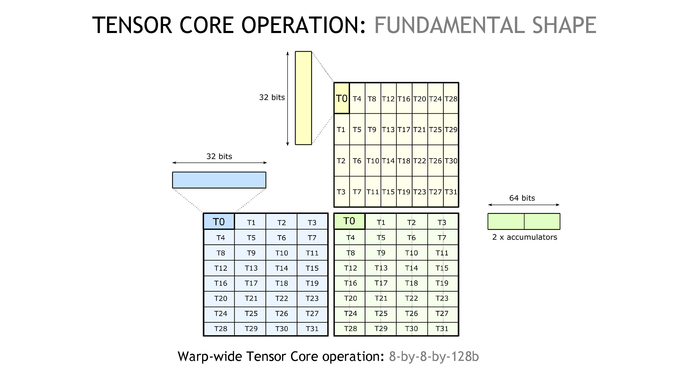
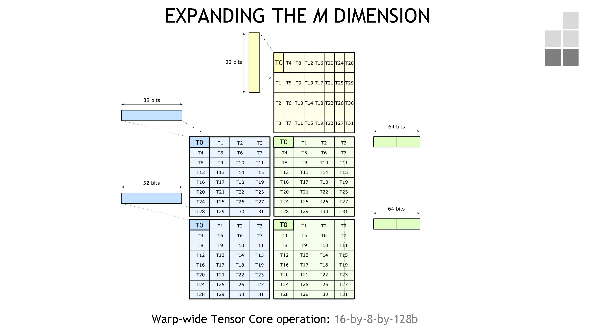
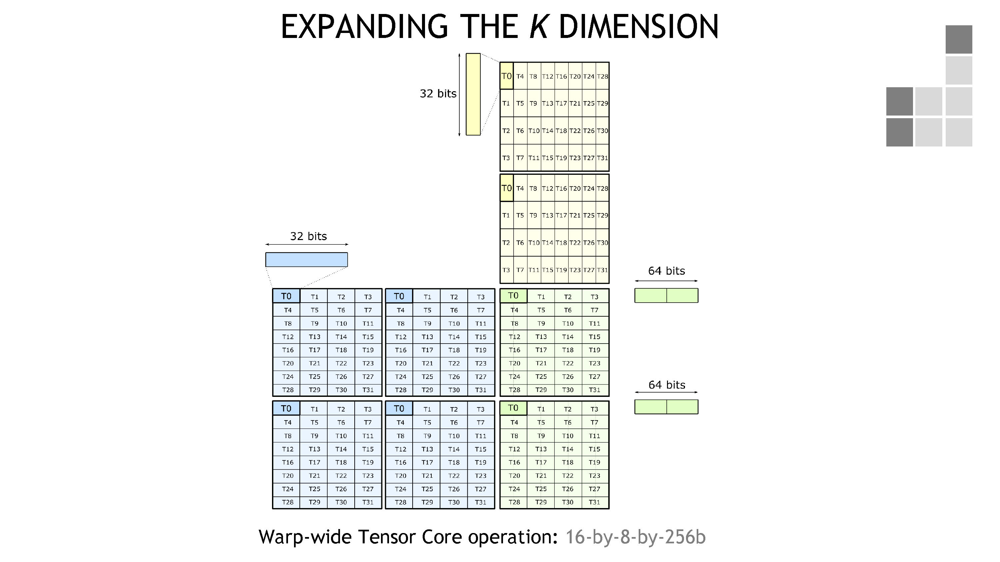
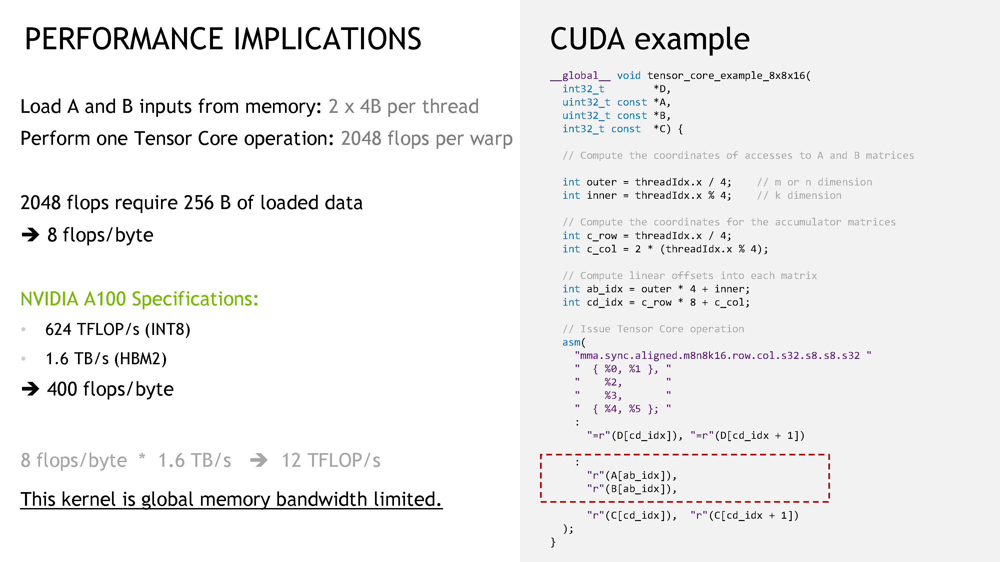
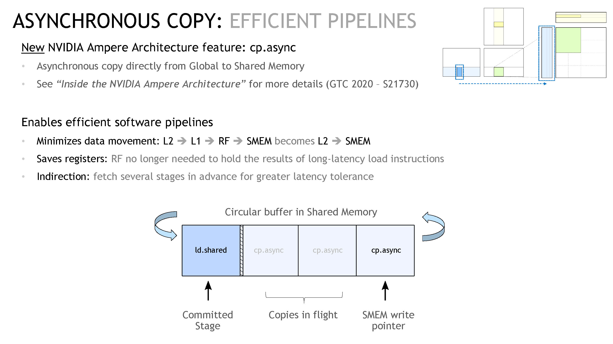
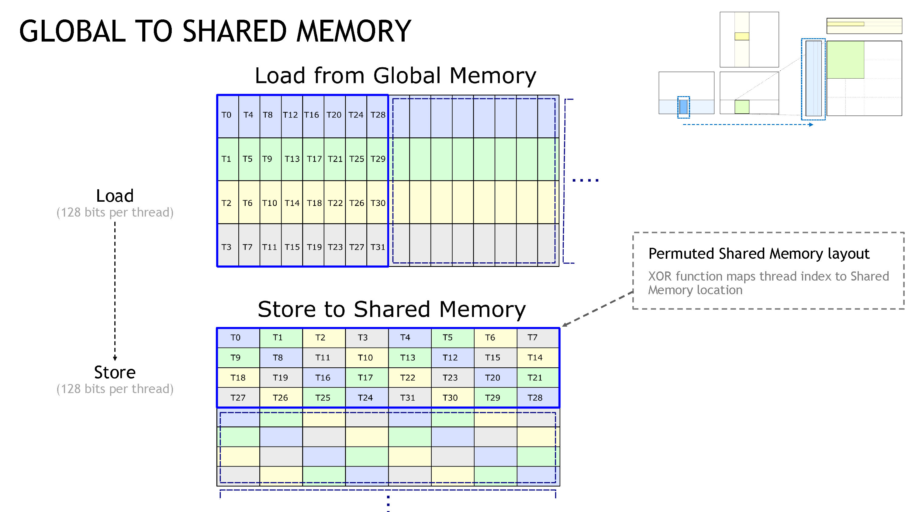

本篇文章主要讲如何通过 `mma` ptx 语句来调用 NVIDIA GPU 的 Tensor Core。

## 主要概念

Tensor Core 执行的是 M-by-N-by-K 的矩阵操作 `D = op(A, B) + C`，这里使用的是 BLAS 的定义，即 `A` 矩阵的维度是 `M x K`，`B` 矩阵的维度是 `K x N`，`C` 和 `D` 矩阵的维度是 `M x N`。我们把 `[M, N, K]` 的组合称为 shape。

Tensor Core 在执行这样的矩阵操作时是 warp-synchronous 的模式，即 warp 中所有线程同时参与运算。而对于拥有 32 个线程的 warp 来说，很明显有一些 shape 对于 warp 来说会比较好处理，如下面讲的 fundamental shape。

### Fundamental Shape

Tensor Core 操作中的 fundamental shape 是 8-by-8-by-128b，见下图。



在图中，蓝色对应矩阵 A，黄色对应矩阵 B，绿色则对应矩阵 C 或 D。因为一个 warp 有 32 个线程，我们可以把这 32 个线程排布成一个 8 x 4 和 4 x 8 的矩阵，分别对应蓝色和黄色部分。如果一个线程持有一个 32b 的数据（可以以图中的 T0 为视角），则依据图示，我们可以看到 K 维度是 128b，所以我们称这个操作是 8-by-8-by-128b 的。我们注意到 T0 拥有两个 accumulator，为了获得 T0 线程的结果，我们需要的是矩阵 A（图中蓝色）的第一行（即 T0-T3 部分），和矩阵 B（图中黄色）的第一、二列（即 T0-T7 部分）。

这个示例就对应了一个实际的 Tensor Core 操作，即 [`mma.m8n8k16`](https://docs.nvidia.com/cuda/parallel-thread-execution/index.html#warp-level-matrix-fragment-mma-8816)，见下图。


这里 `mma.m8n8k16` 针对的场景是 S8 * S8 + S32，即 A 和 B 的类型是有符号单字节整型，accumulator 是有符号 32b 整型。所以我们看到图中，在矩阵 A 中，T0 拥有的 32 位数据对应了 4 个元素，以 little-endian 形式存储。图右侧显示了实际的 ptx 指令，这里每个线程只需要开一个 32b 寄存器作为输入（A 和 B），但是需要两个 32b 寄存器作为 accumulator，因为每个结果元素是以 32b 进行存储的。

这里顺便讲一下这里 `mma` 指令的语法，大体上的格式是

```.asm
mma.sync.aligned.shape.alayout.blayout.dtype.atype.btype.ctype  d, a, b, c;
```

这里

- mma 是表示 Matrix Multiply-and-Accumulate
- sync 表示这句指令之前隐含一个 warp-level sync
- aligned 表示 warp 内所有线程都会执行这同一句指令，如果这一点没有被保证会得到 undefined behavior
- shape 就是这里讲的 [M, N, K] 组合
- alayout、blayout 指的是矩阵 A 和 B 的数据排布（row-major 或 column-major）
- dtype、atype、btype、ctype 指的就是这些矩阵的数据类型了

当然这些参数之间互相还有一些限制，还有一些额外的参数，详情参考[官方文档](https://docs.nvidia.com/cuda/parallel-thread-execution/index.html#warp-level-matrix-instructions-mma)。

### 扩展 M 和 K 维度

在有了 fundamental shape 之后，如果我们想要算更大的 shape 怎么办。很简单的一个想法是，我们直接按照上面的方式再算一次，先从 M 维度开始（见下图）。



这对应了 F16 * F16 + F32 下面的 `mma.m16n8k8` 操作。


那么当然，同理，K 维度也可以得到提升，得到 16-by-8-by-256b 操作。



这对应了 F16 * F16 + F32 下面的 `mma.m16n8k16` 操作。


同时也对应了 S8 * S8 + F32 下面的 `mma.m16n8k32` 操作。


## 数据的加载

我们看到，`mma` 语句主要负责矩阵的计算部分，而矩阵数据的加载也是重要的一环。我们先展示一个 `mma` 语句完整的 Hellow World 示例（见下图）。


而我们分析一下上图中的 kernel 就可以发现这个 kernel 是严重的 bandwidth-bound（分析过程见下图）。



为了加快数据的加载，我们主要有三点可以做：

- 低延迟地加载 global memory
- 无冲突的 shared memory 存储
- 无冲突的 shared memory 读取

下面我们每一点分别来讲。

### 低延迟地加载 global memory

这里主要的做法是使用 Async Copy（`cp.async`）。

这个做法有三点好处：

- 数据的移动路径变短：之前数据是从 L2 → L1 → RF → SMEM，而 `cp.async` 会让数据直接从 L2 → SMEM；
- 减少寄存器用量：因为 RF 被绕过了，所以寄存器的用量也减少了。而且因为这些 load 语句的延迟很高，这些寄存器其实被长时间占用，不能有效地分给 kernel 的其他部分；
- 间接影响：异步拷贝现在可以让我们在 kernel 中进行多 stage 操作，这样我们可以在 kernel 计算时去取数据。如下图最下面的部分，我们可以看到展示了一段循环内存，其中 committed stage 是正在从 SMEM 取数据进行计算的部分，而后面有三个阶段在等待取数据，这样最大限度地喂饱计算单元。



### 无冲突的 shared memory 存储 / 读取

这里我们先介绍一下 `ldmatrix` 指令。`ldmatrix` 是一类特殊的，为了加载 tensor core 所需数据而出现的指令。它加载进来的数据排布是完美迎合了 Tensor Core 操作的。我们看到下图的右下角部分。


`ldmatrix` 工作的原理是，每个线程会有一个指针，指向一行 128b 的数据（见蓝色中黑框框中的 T0-T3 部分），这个线程会读取这 128b 的数据，然后广播给真正需要它的线程们。下图是实际 ptx 指令的示例，我们可以看到这里用了 x4 的指令，即加载了四个蓝色部分的矩阵，所以每个线程加载的数据都没有浪费。


然后为了避免 bank-conflict，我们需要使用 permuted indices，如下图。



这个操作需要我们在使用 `ldmatrix` 进行加载时，把每个线程得到的序号手动错开。